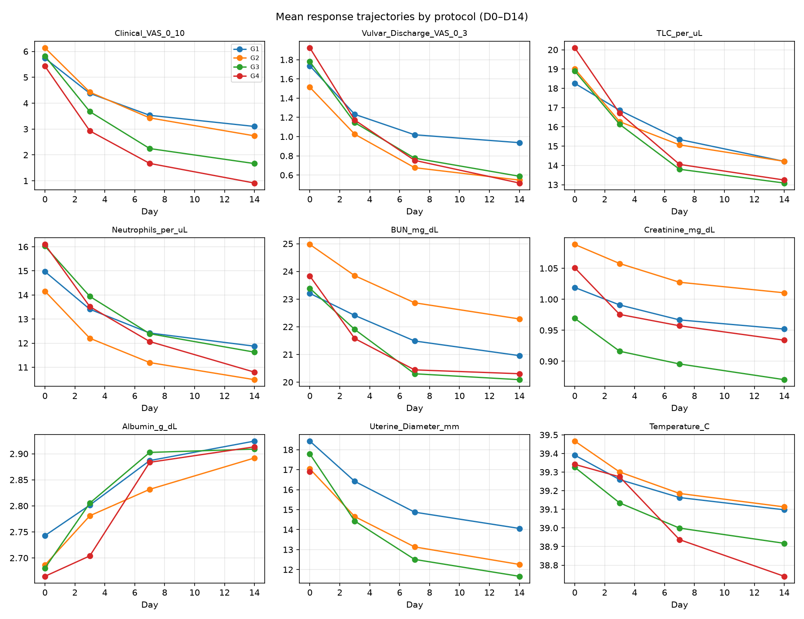
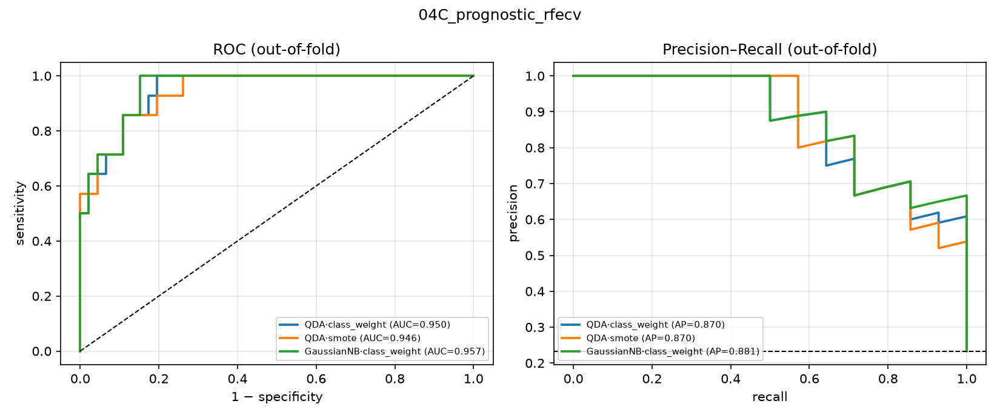
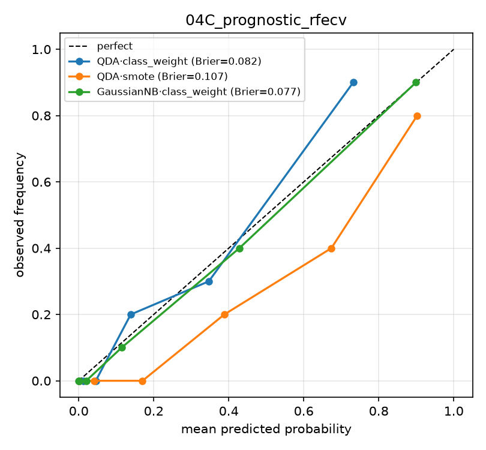
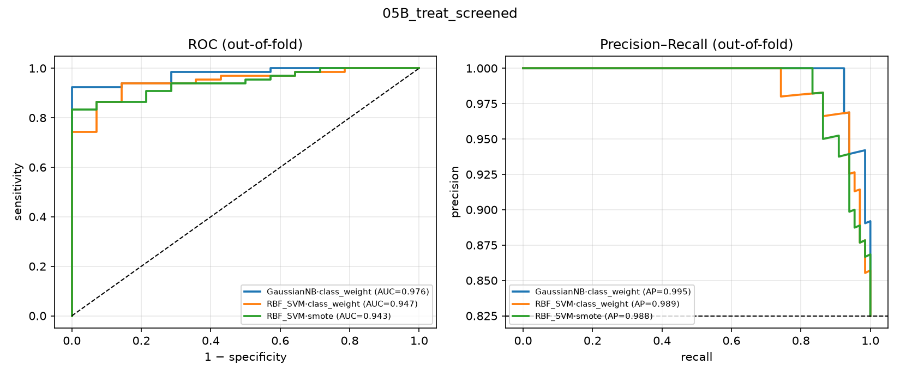

# Canine Pyometra — Machine-Learning Findings

_Generated 2026-09-08 from `results/` by `src/analysis/09_build_report.py`._

> Methodology-demonstration analysis on a clean, randomised, balanced 80-animal
> teaching dataset (no missing baseline data). Hypothesis-generating, not a
> validated clinical tool. Workflow mirrors Nafe Monfared et al. (Front. Vet.
> Sci. 2025) canine-parvovirus prognosis pipeline and the workbook's ML_Roadmap.

---

## 1. Data audit

Sheet inventory:

| frame                        |   rows |   cols |
|:-----------------------------|-------:|-------:|
| baseline_with_outcomes       |     80 |     35 |
| primary_treatment_prediction |     80 |     30 |
| prognostic_G1G3              |     60 |     26 |
| missing_practice_G1G3        |     60 |     21 |
| longitudinal_D0_D3_D7_D14    |    320 |     19 |
| recovery_time                |     74 |     27 |
| retro_240_casemix            |    240 |      5 |

Outcome rates by treatment arm:

| Group                 |   n |   success |   medical_failure |   rescue_OHE |   death |   recurrence_6mo |   mean_days_to_resolution |   success_rate |
|:----------------------|----:|----------:|------------------:|-------------:|--------:|-----------------:|--------------------------:|---------------:|
| G1_Supportive         |  20 |        13 |                 7 |            4 |       0 |                0 |                     5.269 |           0.65 |
| G2_PGF2a              |  20 |        15 |                 5 |            3 |       1 |                3 |                     5.373 |           0.75 |
| G3_Aglepristone_PGF2a |  20 |        18 |                 2 |            1 |       0 |                1 |                     5.006 |           0.9  |
| G4_OHE                |  20 |        20 |                 0 |            0 |       0 |                0 |                     4.588 |           1    |

Randomisation balance across G1-G4 (baseline predictors) — ANOVA / Kruskal-Wallis:

| variable                 |   G1_mean |   G2_mean |   G3_mean |   G4_mean |   ANOVA_p |   KruskalWallis_p |
|:-------------------------|----------:|----------:|----------:|----------:|----------:|------------------:|
| Age_years                |     6.541 |     5.904 |     6.337 |     6.205 |     0.572 |             0.418 |
| Illness_Duration_days    |     4.898 |     5.801 |     5.144 |     6.328 |     0.07  |             0.076 |
| Weight_kg                |    23.06  |    22.773 |    24.222 |    23.476 |     0.878 |             0.827 |
| Temperature_C            |    39.391 |    39.466 |    39.326 |    39.341 |     0.672 |             0.779 |
| Heart_Rate_bpm           |   126.772 |   121.945 |   120.626 |   125.549 |     0.613 |             0.566 |
| Resp_Rate_bpm            |    31.264 |    30.695 |    31.254 |    30.167 |     0.934 |             0.974 |
| Clinical_VAS_0_10        |     5.739 |     6.139 |     5.82  |     5.43  |     0.548 |             0.46  |
| Vulvar_Discharge_VAS_0_3 |     1.736 |     1.513 |     1.78  |     1.923 |     0.169 |             0.168 |
| TLC_per_uL               |    18.259 |    19.011 |    18.896 |    20.101 |     0.635 |             0.525 |
| Neutrophils_per_uL       |    14.97  |    14.157 |    16.026 |    16.095 |     0.46  |             0.363 |
| BUN_mg_dL                |    23.207 |    24.973 |    23.389 |    23.833 |     0.792 |             0.944 |
| Creatinine_mg_dL         |     1.019 |     1.088 |     0.969 |     1.051 |     0.529 |             0.683 |
| ALP_U_L                  |   326.337 |   320.798 |   308.129 |   304.222 |     0.821 |             0.697 |
| ALT_U_L                  |    79.07  |    80.85  |    84.726 |    84.369 |     0.797 |             0.665 |
| Total_Protein_g_dL       |     6.616 |     6.786 |     6.637 |     6.601 |     0.186 |             0.154 |
| Albumin_g_dL             |     2.743 |     2.686 |     2.68  |     2.665 |     0.795 |             0.709 |
| Globulin_g_dL            |     3.873 |     4.1   |     3.957 |     3.937 |     0.284 |             0.362 |
| Uterine_Diameter_mm      |    18.429 |    17.037 |    17.785 |    16.896 |     0.597 |             0.494 |
| Progesterone_ng_mL       |    11.991 |    11.662 |    11.532 |    11.48  |     0.983 |             0.893 |

**Read:** 80 unique dogs, no duplicates, no implausible values. Baseline
variables are balanced across arms (no ANOVA p < 0.05). Observed success
gradient G1 65 % -> G2 75 % -> G3 90 % -> G4 100 %. Death (1/80) and
6-month recurrence (4/80) are too rare to model.

---

## 2. Descriptives & univariate screening

Baseline by D14 outcome, ranked by univariate AUC for *failure*:

| variable                 | failure_mean_sd   | success_mean_sd   |   hedges_g |   univ_AUC_fail |   mannwhitney_p |   welch_t_p |
|:-------------------------|:------------------|:------------------|-----------:|----------------:|----------------:|------------:|
| BUN_mg_dL                | 30.55 ± 4.88      | 22.43 ± 5.15      |       1.57 |           0.891 |           0     |       0     |
| Creatinine_mg_dL         | 1.32 ± 0.23       | 0.97 ± 0.22       |       1.55 |           0.89  |           0     |       0     |
| Albumin_g_dL             | 2.44 ± 0.21       | 2.75 ± 0.23       |      -1.29 |           0.837 |           0     |       0     |
| ALT_U_L                  | 101.71 ± 16.53    | 78.13 ± 19.38     |       1.23 |           0.835 |           0     |       0     |
| ALP_U_L                  | 401.49 ± 80.82    | 296.50 ± 71.65    |       1.42 |           0.831 |           0     |       0     |
| Illness_Duration_days    | 6.89 ± 2.27       | 5.26 ± 1.70       |       0.9  |           0.735 |           0.006 |       0.022 |
| Age_years                | 7.09 ± 1.29       | 6.07 ± 1.42       |       0.72 |           0.733 |           0.007 |       0.016 |
| Uterine_Diameter_mm      | 19.51 ± 4.28      | 17.12 ± 3.81      |       0.61 |           0.695 |           0.023 |       0.07  |
| Globulin_g_dL            | 4.13 ± 0.55       | 3.93 ± 0.33       |       0.53 |           0.635 |           0.115 |       0.203 |
| Clinical_VAS_0_10        | 6.46 ± 2.23       | 5.64 ± 1.32       |       0.54 |           0.632 |           0.124 |       0.204 |
| Temperature_C            | 39.26 ± 0.46      | 39.41 ± 0.37      |      -0.37 |           0.624 |           0.147 |       0.28  |
| Progesterone_ng_mL       | 10.33 ± 3.54      | 11.95 ± 4.48      |      -0.37 |           0.606 |           0.217 |       0.153 |
| Vulvar_Discharge_VAS_0_3 | 1.62 ± 0.55       | 1.76 ± 0.59       |      -0.24 |           0.598 |           0.254 |       0.395 |
| Weight_kg                | 24.89 ± 5.36      | 23.06 ± 5.91      |       0.31 |           0.593 |           0.279 |       0.269 |
| Resp_Rate_bpm            | 31.49 ± 6.90      | 30.71 ± 5.95      |       0.13 |           0.558 |           0.498 |       0.699 |
| Total_Protein_g_dL       | 6.58 ± 0.43       | 6.68 ± 0.27       |      -0.33 |           0.553 |           0.539 |       0.418 |
| TLC_per_uL               | 19.83 ± 6.31      | 18.91 ± 4.04      |       0.2  |           0.552 |           0.548 |       0.608 |
| Heart_Rate_bpm           | 125.76 ± 18.25    | 123.29 ± 16.32    |       0.15 |           0.528 |           0.752 |       0.646 |
| Neutrophils_per_uL       | 14.68 ± 3.05      | 15.45 ± 4.68      |      -0.17 |           0.522 |           0.805 |       0.45  |

Derived risk flags vs failure:

| flag                        |   n_flag_pos |   fail_rate_flag1 |   fail_rate_flag0 |   risk_diff |   chi2_p |
|:----------------------------|-------------:|------------------:|------------------:|------------:|---------:|
| Azotemia_flag               |           24 |             0.5   |             0.036 |       0.464 |    0     |
| High_Clinical_Severity_flag |           13 |             0.538 |             0.104 |       0.434 |    0.001 |
| Leukocytosis_flag           |           18 |             0.389 |             0.113 |       0.276 |    0.018 |
| Hypoalbuminemia_flag        |           18 |             0.333 |             0.129 |       0.204 |    0.098 |
| Severe_Inflammation_flag    |            4 |             0.25  |             0.171 |       0.079 |    1     |

**Read:** renal markers (BUN, creatinine), hepatic markers (ALT, ALP) and
hypoalbuminaemia separate failures from successes most strongly; illness
duration and age are weaker secondary signals.

---

## 3. Longitudinal analysis (mixed model: Group * Day + 1|ID)

| response                 |   Day_beta |   Day_p |   min_GroupxDay_p | any_GroupxDay_sig   |
|:-------------------------|-----------:|--------:|------------------:|:--------------------|
| Clinical_VAS_0_10        |     -0.175 |       0 |             0     | True                |
| Vulvar_Discharge_VAS_0_3 |     -0.051 |       0 |             0     | True                |
| TLC_per_uL               |     -0.283 |       0 |             0.003 | True                |
| Neutrophils_per_uL       |     -0.206 |       0 |             0     | True                |
| BUN_mg_dL                |     -0.158 |       0 |             0.089 | False               |
| Creatinine_mg_dL         |     -0.005 |       0 |             0.018 | True                |
| Albumin_g_dL             |      0.013 |       0 |             0.005 | True                |
| Uterine_Diameter_mm      |     -0.295 |       0 |             0.051 | False               |
| Temperature_C            |     -0.02  |       0 |             0     | True                |

*Mean response trajectories by protocol, D0-D14*

---

## 4. Prognostic model (G1-G3, admission variables only -> Medical_Failure_D14)

Stage progression (all predictors -> univariate screen -> RFECV):

| stage      |   n_predictors | best_model   | best_resampling   | best_ROC_AUC   | best_PR_AUC   |
|:-----------|---------------:|:-------------|:------------------|:---------------|:--------------|
| A_all      |             19 | RandomForest | class_weight      | 0.946 ± 0.078  | 0.892 ± 0.142 |
| B_screened |             13 | RandomForest | class_weight      | 0.951 ± 0.069  | 0.899 ± 0.126 |
| C_rfecv    |              3 | QDA          | class_weight      | 0.953 ± 0.061  | 0.896 ± 0.130 |

Univariate logistic screen:

| predictor                |   OR_per_SD |   p_value |
|:-------------------------|------------:|----------:|
| BUN_mg_dL                |      17.527 |     0     |
| Creatinine_mg_dL         |       8.273 |     0.001 |
| Albumin_g_dL             |       0.125 |     0.001 |
| ALP_U_L                  |       7.041 |     0.001 |
| ALT_U_L                  |       6.832 |     0.001 |
| Illness_Duration_days    |       3.948 |     0.001 |
| Age_years                |       2.239 |     0.02  |
| Uterine_Diameter_mm      |       1.842 |     0.074 |
| Globulin_g_dL            |       1.706 |     0.086 |
| Clinical_VAS_0_10        |       1.615 |     0.146 |
| Temperature_C            |       0.619 |     0.159 |
| Total_Protein_g_dL       |       0.652 |     0.164 |
| Progesterone_ng_mL       |       0.643 |     0.176 |
| Weight_kg                |       1.422 |     0.263 |
| TLC_per_uL               |       1.376 |     0.302 |
| Heart_Rate_bpm           |       1.245 |     0.47  |
| Vulvar_Discharge_VAS_0_3 |       0.881 |     0.681 |
| Neutrophils_per_uL       |       0.893 |     0.713 |
| Resp_Rate_bpm            |       1.093 |     0.773 |

Best-stage model comparison (RFECV feature set):

| resampling   | model             | ROC_AUC       | PR_AUC        | Balanced_Acc   | Sensitivity   | Specificity   | F1            | Brier         |
|:-------------|:------------------|:--------------|:--------------|:---------------|:--------------|:--------------|:--------------|:--------------|
| class_weight | QDA               | 0.953 ± 0.061 | 0.896 ± 0.130 | 0.782 ± 0.152  | 0.583 ± 0.299 | 0.980 ± 0.042 | 0.666 ± 0.273 | 0.081 ± 0.034 |
| smote        | QDA               | 0.952 ± 0.063 | 0.892 ± 0.130 | 0.841 ± 0.110  | 0.863 ± 0.210 | 0.818 ± 0.150 | 0.715 ± 0.163 | 0.108 ± 0.051 |
| class_weight | GaussianNB        | 0.949 ± 0.066 | 0.886 ± 0.140 | 0.813 ± 0.135  | 0.700 ± 0.252 | 0.926 ± 0.084 | 0.709 ± 0.218 | 0.083 ± 0.049 |
| class_weight | LogReg_L2         | 0.949 ± 0.062 | 0.885 ± 0.136 | 0.847 ± 0.120  | 0.840 ± 0.228 | 0.853 ± 0.132 | 0.730 ± 0.174 | 0.096 ± 0.046 |
| smote        | LogReg_L2         | 0.948 ± 0.067 | 0.883 ± 0.142 | 0.843 ± 0.119  | 0.823 ± 0.222 | 0.862 ± 0.121 | 0.729 ± 0.172 | 0.099 ± 0.051 |
| class_weight | LogReg_ElasticNet | 0.947 ± 0.065 | 0.884 ± 0.136 | 0.829 ± 0.126  | 0.810 ± 0.231 | 0.849 ± 0.139 | 0.710 ± 0.182 | 0.101 ± 0.042 |
| smote        | LogReg_ElasticNet | 0.946 ± 0.070 | 0.879 ± 0.144 | 0.834 ± 0.123  | 0.813 ± 0.225 | 0.855 ± 0.124 | 0.718 ± 0.182 | 0.102 ± 0.048 |
| class_weight | LDA               | 0.944 ± 0.068 | 0.878 ± 0.140 | 0.776 ± 0.150  | 0.607 ± 0.290 | 0.946 ± 0.077 | 0.650 ± 0.258 | 0.082 ± 0.038 |

*Prognostic model — out-of-fold ROC & PR (RFECV features)*

*Prognostic model — calibration*

Penalised logistic-regression odds ratios (RFECV features):

| term         |   coef |    OR |   OR_lo95 |   OR_hi95 |      z |     p |
|:-------------|-------:|------:|----------:|----------:|-------:|------:|
| const        | -2.169 | 0.114 |     0.035 |     0.375 | -3.578 | 0     |
| BUN_mg_dL    |  1.061 | 2.889 |     0.753 |    11.076 |  1.547 | 0.122 |
| ALP_U_L      |  1.27  | 3.562 |     0.917 |    13.838 |  1.834 | 0.067 |
| Albumin_g_dL | -1.191 | 0.304 |     0.083 |     1.113 | -1.798 | 0.072 |

**Read:** discrimination is high and stable across all three feature-set stages
(ROC-AUC ≈ 0.95). The top ~6 algorithms differ by less than the CV standard
deviation, so model choice is not critical — L2 logistic regression and random
forest give essentially the same performance as the nominal best (QDA on the
3-feature RFECV set) while being easier to explain. All final models point to
the same drivers: **higher BUN / creatinine / ALP and lower albumin** raise the
probability of medical failure.

---

## 5. Treatment-outcome model (all G1-G4, Group retained -> Treatment_Success_D14)

Stage progression + G1-G3 sensitivity analysis:

| stage             |   n_predictors | best_model   | best_resampling   | best_ROC_AUC   | best_PR_AUC   |
|:------------------|---------------:|:-------------|:------------------|:---------------|:--------------|
| A_all+Group       |             20 | GaussianNB   | class_weight      | 0.955 ± 0.088  | 0.988 ± 0.034 |
| B_screened+Group  |             11 | GaussianNB   | class_weight      | 0.960 ± 0.088  | 0.989 ± 0.034 |
| C_rfecv+Group     |              4 | LinearSVM    | class_weight      | 0.972 ± 0.037  | 0.994 ± 0.008 |
| Sens_G1G3_noGroup |             10 | GaussianNB   | class_weight      | 0.947 ± 0.080  | 0.984 ± 0.027 |

Model comparison (screened feature set + Group):

| resampling   | model             | ROC_AUC       | PR_AUC        | Balanced_Acc   | Sensitivity   | Specificity   | F1            | Brier         |
|:-------------|:------------------|:--------------|:--------------|:---------------|:--------------|:--------------|:--------------|:--------------|
| class_weight | GaussianNB        | 0.960 ± 0.088 | 0.989 ± 0.034 | 0.828 ± 0.083  | 0.690 ± 0.113 | 0.967 ± 0.137 | 0.808 ± 0.078 | 0.235 ± 0.089 |
| class_weight | RBF_SVM           | 0.940 ± 0.063 | 0.988 ± 0.013 | 0.716 ± 0.137  | 0.948 ± 0.065 | 0.483 ± 0.285 | 0.921 ± 0.039 | 0.080 ± 0.028 |
| smote        | RBF_SVM           | 0.938 ± 0.061 | 0.988 ± 0.013 | 0.687 ± 0.141  | 0.968 ± 0.046 | 0.407 ± 0.277 | 0.923 ± 0.039 | 0.093 ± 0.044 |
| class_weight | RandomForest      | 0.937 ± 0.049 | 0.987 ± 0.010 | 0.768 ± 0.139  | 0.933 ± 0.054 | 0.603 ± 0.287 | 0.925 ± 0.035 | 0.081 ± 0.024 |
| smote        | RandomForest      | 0.930 ± 0.052 | 0.986 ± 0.011 | 0.758 ± 0.143  | 0.900 ± 0.073 | 0.617 ± 0.287 | 0.908 ± 0.046 | 0.085 ± 0.027 |
| smote        | GaussianNB        | 0.930 ± 0.097 | 0.982 ± 0.035 | 0.806 ± 0.099  | 0.708 ± 0.130 | 0.903 ± 0.195 | 0.812 ± 0.086 | 0.234 ± 0.093 |
| class_weight | LDA               | 0.927 ± 0.066 | 0.985 ± 0.015 | 0.770 ± 0.135  | 0.939 ± 0.054 | 0.600 ± 0.294 | 0.928 ± 0.029 | 0.087 ± 0.034 |
| class_weight | LogReg_ElasticNet | 0.922 ± 0.080 | 0.984 ± 0.018 | 0.810 ± 0.136  | 0.867 ± 0.077 | 0.753 ± 0.271 | 0.902 ± 0.048 | 0.106 ± 0.039 |

*Treatment-outcome model — out-of-fold ROC & PR*

Full-cohort odds ratios (screened + Group) — **unstable, see caveat**:

| term                        |   coef |     OR |   OR_lo95 |   OR_hi95 |       z |       p |
|:----------------------------|-------:|-------:|----------:|----------:|--------:|--------:|
| const                       |  2.011 |  7.474 |     1.429 |    39.076 |   2.383 |   0.017 |
| BUN_mg_dL                   | -0.769 |  0.463 |     0.13  |     1.652 |  -1.186 |   0.235 |
| Creatinine_mg_dL            | -0.193 |  0.825 |     0.199 |     3.41  |  -0.266 |   0.79  |
| ALP_U_L                     | -0.909 |  0.403 |     0.118 |     1.371 |  -1.455 |   0.146 |
| Albumin_g_dL                |  0.707 |  2.028 |     0.465 |     8.848 |   0.941 |   0.347 |
| ALT_U_L                     |  0     |  1     |   nan     |   nan     | nan     | nan     |
| Illness_Duration_days       | -0.133 |  0.876 |     0.383 |     2.001 |  -0.315 |   0.753 |
| Age_years                   | -0.47  |  0.625 |     0.261 |     1.497 |  -1.054 |   0.292 |
| Uterine_Diameter_mm         |  0     |  1     |   nan     |   nan     | nan     | nan     |
| Clinical_VAS_0_10           |  0     |  1     |   nan     |   nan     | nan     | nan     |
| Globulin_g_dL               |  0     |  1     |   nan     |   nan     | nan     | nan     |
| Group_G1_Supportive         | -0.398 |  0.671 |     0.083 |     5.432 |  -0.374 |   0.709 |
| Group_G2_PGF2a              |  0     |  1     |   nan     |   nan     | nan     | nan     |
| Group_G3_Aglepristone_PGF2a |  0.749 |  2.115 |     0.169 |    26.535 |   0.581 |   0.562 |
| Group_G4_OHE                |  2.59  | 13.331 |     0.644 |   275.981 |   1.675 |   0.094 |

**Caveat:** G4 (OHE) is perfectly separated (20/20 success), so the full-cohort
`Group` odds ratios and the near-zero ridge-shrunk coefficients above are
artefacts and shown for completeness only.

### G1–G3 sensitivity model (Group dropped — the interpretable one)

| resampling   | model                | ROC_AUC       | PR_AUC        | Balanced_Acc   | Sensitivity   | Specificity   | F1            | Brier         |
|:-------------|:---------------------|:--------------|:--------------|:---------------|:--------------|:--------------|:--------------|:--------------|
| class_weight | GaussianNB           | 0.947 ± 0.080 | 0.984 ± 0.027 | 0.819 ± 0.145  | 0.874 ± 0.117 | 0.763 ± 0.241 | 0.895 ± 0.087 | 0.117 ± 0.093 |
| class_weight | RandomForest         | 0.943 ± 0.077 | 0.983 ± 0.024 | 0.795 ± 0.139  | 0.917 ± 0.097 | 0.673 ± 0.256 | 0.909 ± 0.067 | 0.086 ± 0.042 |
| smote        | RandomForest         | 0.938 ± 0.085 | 0.982 ± 0.026 | 0.808 ± 0.137  | 0.900 ± 0.104 | 0.717 ± 0.250 | 0.904 ± 0.073 | 0.093 ± 0.047 |
| class_weight | HistGradientBoosting | 0.938 ± 0.083 | 0.980 ± 0.032 | 0.779 ± 0.143  | 0.935 ± 0.084 | 0.623 ± 0.284 | 0.912 ± 0.057 | 0.092 ± 0.049 |
| class_weight | XGBoost              | 0.932 ± 0.082 | 0.981 ± 0.025 | 0.753 ± 0.155  | 0.937 ± 0.088 | 0.570 ± 0.287 | 0.906 ± 0.067 | 0.098 ± 0.060 |
| smote        | GaussianNB           | 0.928 ± 0.103 | 0.978 ± 0.034 | 0.835 ± 0.155  | 0.869 ± 0.118 | 0.800 ± 0.281 | 0.897 ± 0.086 | 0.129 ± 0.100 |

Odds ratios (G1–G3, admission variables only, outcome = *success*):

| term                  |   coef |    OR |   OR_lo95 |   OR_hi95 |       z |       p |
|:----------------------|-------:|------:|----------:|----------:|--------:|--------:|
| const                 |  2.06  | 7.849 |     2.499 |    24.656 |   3.528 |   0     |
| BUN_mg_dL             | -0.915 | 0.401 |     0.094 |     1.707 |  -1.237 |   0.216 |
| Creatinine_mg_dL      | -0.382 | 0.682 |     0.151 |     3.073 |  -0.498 |   0.619 |
| ALP_U_L               | -0.936 | 0.392 |     0.098 |     1.576 |  -1.319 |   0.187 |
| Albumin_g_dL          |  0.716 | 2.046 |     0.488 |     8.573 |   0.979 |   0.328 |
| ALT_U_L               |  0     | 1     |   nan     |   nan     | nan     | nan     |
| Illness_Duration_days | -0.342 | 0.711 |     0.304 |     1.662 |  -0.788 |   0.431 |
| Age_years             | -0.477 | 0.621 |     0.239 |     1.611 |  -0.979 |   0.327 |
| Uterine_Diameter_mm   |  0     | 1     |   nan     |   nan     | nan     | nan     |
| Clinical_VAS_0_10     |  0     | 1     |   nan     |   nan     | nan     | nan     |
| Globulin_g_dL         |  0     | 1     |   nan     |   nan     | nan     | nan     |

**Read:** on the medical cohort the treatment-success model reproduces the
prognostic model mirror-image — higher BUN / ALP push toward failure, higher
albumin toward success — and still discriminates well (ROC-AUC ≈ 0.95).

---

## 6. Missing-data strategy (ML_missing_5pct, ~5 % MCAR)

Imputation accuracy (standardised RMSE vs the true values):

| imputer   |   imputed_cells |   RMSE_z |   MAE_z |
|:----------|----------------:|---------:|--------:|
| iterative |              57 |    0.983 |   0.748 |
| mean      |              57 |    1.136 |   0.912 |
| median    |              57 |    1.144 |   0.923 |
| knn5      |              57 |    1.151 |   0.92  |

Downstream prognostic-model AUC by imputer:

| imputer   | model            | ROC_AUC       | PR_AUC        |
|:----------|:-----------------|:--------------|:--------------|
| median    | RandomForest     | 0.932 ± 0.087 | 0.875 ± 0.128 |
| median    | GradientBoosting | 0.895 ± 0.123 | 0.825 ± 0.167 |
| median    | LogReg_L1_LASSO  | 0.853 ± 0.173 | 0.753 ± 0.210 |
| mean      | RandomForest     | 0.933 ± 0.087 | 0.873 ± 0.135 |
| mean      | GradientBoosting | 0.887 ± 0.129 | 0.808 ± 0.176 |
| mean      | LogReg_L1_LASSO  | 0.853 ± 0.175 | 0.754 ± 0.210 |
| knn5      | RandomForest     | 0.938 ± 0.079 | 0.880 ± 0.131 |
| knn5      | GradientBoosting | 0.898 ± 0.114 | 0.814 ± 0.189 |
| knn5      | LogReg_L1_LASSO  | 0.850 ± 0.164 | 0.748 ± 0.200 |
| iterative | RandomForest     | 0.939 ± 0.082 | 0.883 ± 0.137 |
| iterative | GradientBoosting | 0.897 ± 0.109 | 0.821 ± 0.170 |
| iterative | LogReg_L1_LASSO  | 0.846 ± 0.169 | 0.744 ± 0.208 |

---

## 7. Recovery-time regression (Days_to_Resolution, n = 74)

| model            | MAE_days      | RMSE_days     | R2             |
|:-----------------|:--------------|:--------------|:---------------|
| RandomForestReg  | 0.976 ± 0.202 | 1.215 ± 0.234 | -0.257 ± 0.401 |
| KNNReg           | 0.994 ± 0.186 | 1.227 ± 0.202 | -0.284 ± 0.366 |
| LinearRegression | 1.151 ± 0.210 | 1.421 ± 0.238 | -0.761 ± 0.664 |
| DecisionTreeReg  | 1.186 ± 0.214 | 1.461 ± 0.251 | -0.936 ± 0.966 |

Univariate association with recovery time:

| predictor                |   spearman_rho |   p_value |
|:-------------------------|---------------:|----------:|
| BUN_mg_dL                |          0.33  |     0.004 |
| Creatinine_mg_dL         |          0.243 |     0.037 |
| Neutrophils_per_uL       |         -0.239 |     0.04  |
| ALP_U_L                  |          0.228 |     0.051 |
| Albumin_g_dL             |         -0.204 |     0.082 |
| ALT_U_L                  |          0.172 |     0.142 |
| Group                    |        nan     |     0.161 |
| Illness_Duration_days    |          0.148 |     0.207 |
| Globulin_g_dL            |          0.148 |     0.208 |
| TLC_per_uL               |         -0.136 |     0.246 |
| Age_years                |          0.125 |     0.29  |
| Clinical_VAS_0_10        |          0.123 |     0.298 |
| Uterine_Diameter_mm      |          0.101 |     0.392 |
| Total_Protein_g_dL       |          0.097 |     0.411 |
| Resp_Rate_bpm            |         -0.09  |     0.447 |
| Temperature_C            |         -0.087 |     0.459 |
| Vulvar_Discharge_VAS_0_3 |         -0.049 |     0.676 |
| Heart_Rate_bpm           |         -0.044 |     0.708 |
| Weight_kg                |          0.029 |     0.809 |
| Progesterone_ng_mL       |         -0.016 |     0.895 |

Recovery time by protocol:

| Group                 |   count |   mean |   std |
|:----------------------|--------:|-------:|------:|
| G1_Supportive         |      17 |   5.27 |  1.45 |
| G2_PGF2a              |      18 |   5.37 |  1.16 |
| G3_Aglepristone_PGF2a |      19 |   5.01 |  0.95 |
| G4_OHE                |      20 |   4.59 |  1.02 |

---

## 8. Admission risk score -> protocol recommendation

Score weights (per 1 SD of admission value):

| variable              |   beta_per_SD |   OR_per_SD |   points_per_SD |
|:----------------------|--------------:|------------:|----------------:|
| BUN_mg_dL             |         0.915 |        2.5  |               3 |
| Creatinine_mg_dL      |         0.382 |        1.47 |               1 |
| Albumin_g_dL          |        -0.716 |        0.49 |              -2 |
| ALP_U_L               |         0.936 |        2.55 |               3 |
| Age_years             |         0.477 |        1.61 |               1 |
| Illness_Duration_days |         0.342 |        1.41 |               1 |

Success rate by risk class:

| risk_class   |   n |   success_rate |   med_failure_rate |
|:-------------|----:|---------------:|-------------------:|
| Low          |  27 |          1     |              0     |
| Medium       |  26 |          0.962 |              0.038 |
| High         |  27 |          0.519 |              0.481 |

Risk class x protocol x outcome:

| risk_class   | Group                 |   n |   success |   med_failure |   rescue_OHE |   success_rate |
|:-------------|:----------------------|----:|----------:|--------------:|-------------:|---------------:|
| Low          | G1_Supportive         |   7 |         7 |             0 |            0 |           1    |
| Low          | G2_PGF2a              |   7 |         7 |             0 |            0 |           1    |
| Low          | G3_Aglepristone_PGF2a |   7 |         7 |             0 |            0 |           1    |
| Low          | G4_OHE                |   6 |         6 |             0 |            0 |           1    |
| Medium       | G1_Supportive         |   5 |         4 |             1 |            0 |           0.8  |
| Medium       | G2_PGF2a              |   7 |         7 |             0 |            0 |           1    |
| Medium       | G3_Aglepristone_PGF2a |   7 |         7 |             0 |            0 |           1    |
| Medium       | G4_OHE                |   7 |         7 |             0 |            0 |           1    |
| High         | G1_Supportive         |   8 |         2 |             6 |            4 |           0.25 |
| High         | G2_PGF2a              |   6 |         1 |             5 |            3 |           0.17 |
| High         | G3_Aglepristone_PGF2a |   6 |         4 |             2 |            1 |           0.67 |
| High         | G4_OHE                |   7 |         7 |             0 |            0 |           1    |

**Practical reading (hypothesis-generating, n = 80):**
- **Low risk** — every protocol reached 100 % success; medical management,
  including supportive-only (G1), is adequate.
- **Medium risk** — supportive-only (G1) slips (~0.80); G2 / G3 and OHE ~1.00,
  so an active medical protocol is preferred over G1 alone.
- **High risk** — medical success collapses (G1 ~0.25, G2 ~0.17); aglepristone +
  PGF2alpha (G3) is the best medical option (~0.67); OHE (G4) remains ~1.00 and
  is the safe definitive choice.

---

## Limitations

1. Single synthetic/simulated-looking cohort, n = 80, 14 failure events — wide
   confidence intervals; external validity unknown.
2. G4 non-randomised w.r.t. severity and perfectly separated on outcome.
3. The 240-case retrospective sheet has no outcome column — usable only for
   case-mix description, not prognostic validation.
4. Repeated cross-validation gives an optimism-reduced *internal* estimate only.
